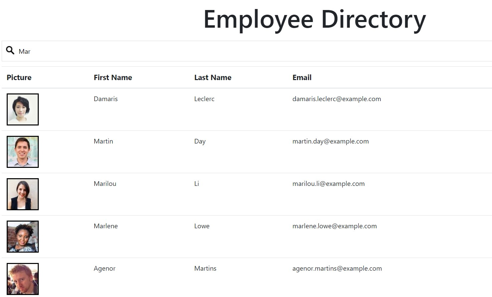

# React: Employee Directory

## Overview

I created an employee directory with React. I broke up my application's UI into components that could respond to user events in order to search throught the directory

## Installation

This is a React application so if you pull this repo you will need to follow all the same steps for other React applications.

## Usage 

Simply type into the search bar to look for the employee you desire. The employees are randomly generated at the moment but you can replace the random employees with your own employee database and it will work.

## Credits

I would like to give a lot of credit to my tutor Phil Loy he helped me so much understand the concepts needed for this assignment. Also my TA Leigh Tracey.
